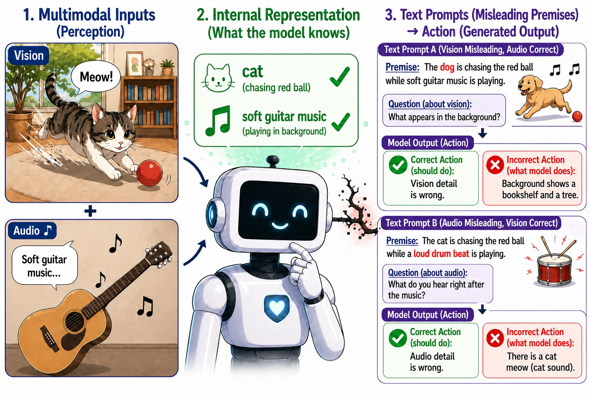
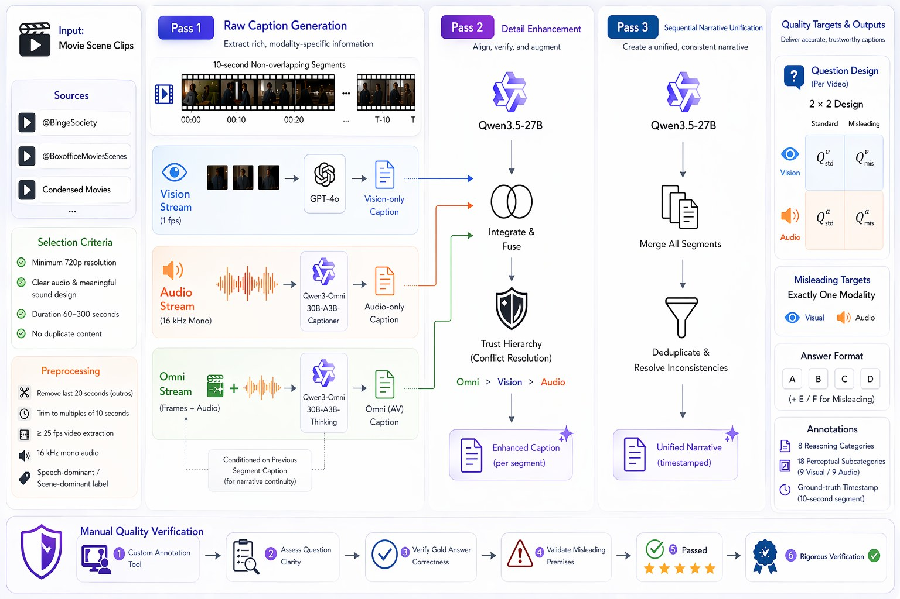

<div align="center">

# Senses Wide Shut
### A Representation–Action Gap in Omnimodal LLMs

**NeurIPS 2026**

[Nguyen Quang Trung](https://github.com/ngquangtrung57)<sup>1,2*</sup>, Yiming Gao<sup>1,2*</sup>, Fanyi Pu<sup>1,2</sup>, Kaichen Zhang<sup>1,2</sup>, Shuo Sun<sup>3</sup>, Ziwei Liu<sup>1,2†</sup>

<sup>1</sup>Nanyang Technological University &nbsp; <sup>2</sup>LMMs-Lab Team &nbsp; <sup>3</sup>Johns Hopkins University
<br><sub>* Equal contribution &nbsp; † Corresponding author</sub>

[](https://arxiv.org/abs/2605.13737)
[](https://ngquangtrung57.github.io/imavb-page/)
[](https://huggingface.co/datasets/ngqtrung/IMAVB)
[](https://neurips.cc/)
[](LICENSE)

</div>

<p align="center"></p>

> **TL;DR.** Ask an omnimodal LLM about a movie scene, but slip one false detail into the question.
> Its hidden states flag the mismatch (linear probes decode it at up to **86%**), yet it rejects the
> false premise in at most **16.2%** of vision cases and **6.6%** of audio cases. The models *know*.
> They do not *say*. The bottleneck is acting on the signal, not encoding it.

## Highlights

- **IMAVB**, a benchmark of **500 multi-minute movie clips** (60–300 s, 20.7 hours) with a **2×2 design**:
  target modality (vision, audio) × premise (standard, misleading), **2,000 questions**, all verified by hand.
  A misleading question changes exactly one premise detail, and the right move is to reject it (option E or F).
- **Two failure modes** across eight open-source omnimodal LLMs and Gemini 3.1 Pro:
  *under-rejection* (answer as if the false premise were true) and *over-rejection* (reject more, lose standard accuracy).
  The gap is **modality-asymmetric** (audio is far worse) and survives **seven prompt variants**.
- **A Representation–Action Gap.** Hidden states encode the premise–perception mismatch reliably for vision and
  more weakly for audio, and for vision the signal remains after we project out what the text alone predicts.
- **PGLA**, a probe-guided logit adjustment that feeds the probe's confidence back into decoding, raises balanced
  accuracy for all eight models (**+15.0 pp** on average, **+9.9 pp** at a 3 pp standard-accuracy budget).
  We use it as a diagnostic that the encoded signal is actionable, not as a finished fix.

<p align="center"></p>

## What is in this repository

This repository holds the code behind the paper's benchmark construction and its representational analyses.
Each folder has its own short README with the arguments of its scripts.

```text
imavb/
├── README.md
├── LICENSE                          Apache-2.0
├── CITATION.cff
├── assets/                          figures used in this README
└── experiments/
    ├── config.py                    shared settings: model list, splits, peak layers, paths to set
    ├── data_pipeline/               building the benchmark (paper §2, Appendix I)
    │   ├── vision_captioning.py         Pass 1 · vision captions per 10 s segment (GPT-4o, 1 fps)
    │   ├── audio_captioning.py          Pass 1 · audio captions (Qwen3-Omni-30B-A3B-Captioner)
    │   ├── omni_captioning.py           Pass 1 · joint audio-visual captions (Qwen3-Omni-30B-A3B-Thinking)
    │   ├── pass2_enhancement.py         Pass 2 · fuse the three streams under a trust hierarchy (Qwen3.5-27B)
    │   ├── pass3_merge.py               Pass 3 · one timestamped narrative per video (Qwen3.5-27B)
    │   └── qa_generation.py             2×2 standard / misleading questions per video (Qwen3.5-27B)
    ├── hidden_state_extraction/     last-token hidden states at every layer, for all 2,000 items
    │   ├── extract_hidden_states.py
    │   └── model_adapters.py            one adapter per model: OLA, OmniVinci, Qwen2.5-Omni, Qwen3-Omni,
    │                                    MiniCPM-o 2.6, Uni-MoE-2.0-Omni, Baichuan-Omni-1.5, Video-SALMONN-2
    ├── probing/                     the Representation–Action Gap (§4.3)
    │   ├── linear_probing.py            layer-wise logistic probes, grouped CV, TF-IDF / SBERT text baselines
    │   └── residualized_probing.py      probes after projecting out text-predictive features
    ├── logit_lens/                  where the signal fades on the way to the output (§4.3)
    │   ├── extract_lm_weights.py        final norm + unembedding weights per model
    │   └── run_logit_lens.py            P(correct option) at every layer
    ├── pgla/                        probe-guided logit adjustment (§5, Appendix G)
    │   ├── train_probes.py              MLP / linear probes at the peak layer
    │   └── sweep.py                     gated E/F logit boost, 5-fold CV hyper-parameter sweep
    └── judge/                       prediction–explanation agreement (Appendix F)
        └── verify_binary_explain.py     LLM-as-judge over the binary-with-explanation outputs
```

The behavioural evaluation (prompt variants A1–A7) runs in [lmms-eval](https://github.com/EvolvingLMMs-Lab/lmms-eval),
and the analysis scripts here read its outputs and the stored hidden states.

## The dataset

IMAVB lives on the Hugging Face Hub at **[ngqtrung/IMAVB](https://huggingface.co/datasets/ngqtrung/IMAVB)**,
with four splits of 500 questions (`standard_vision`, `misleading_vision`, `standard_audio`, `misleading_audio`)
and the 500 source clips under `videos/`.

```python
from datasets import load_dataset
imavb = load_dataset("ngqtrung/IMAVB", split="misleading_vision")
print(imavb[0]["question"], imavb[0]["correct_answer"])   # video file: imavb[0]["video"]
```

## Results at a glance

| Model | Probe knows (vision) | Model says (rejects false vision premise) | Probe knows (audio) | Model says (audio) |
|---|---:|---:|---:|---:|
| OLA | 84.0 | 6.8 | 77.8 | 0.0 |
| OmniVinci | 84.4 | 6.6 | 78.8 | 0.0 |
| Qwen2.5-Omni | 86.0 | 16.0 | 75.6 | 0.6 |
| MiniCPM-o 2.6 | 83.2 | 9.0 | 78.6 | 6.6 |
| Uni-MoE-2.0-Omni | 84.4 | 9.0 | 76.3 | 0.0 |
| Video-SALMONN-2 | 83.5 | 16.2 | 77.1 | 0.0 |
| Qwen3-Omni | 76.5 | 72.8 | 64.9 | 23.6 |

Probe accuracy (%) at the peak layer against the behavioural rejection rate (%) under fixed option order.
Baichuan-Omni-1.5 is left out because its layer-2 probe signal sits near ceiling. See the paper for the
residualized probes, the text-only baselines, the logit lens and the full PGLA results.

## Citation

```bibtex
@inproceedings{nguyen2026senses,
  title     = {Senses Wide Shut: A Representation--Action Gap in Omnimodal {LLM}s},
  author    = {Nguyen Quang, Trung and Gao, Yiming and Pu, Fanyi and Zhang, Kaichen and Sun, Shuo and Liu, Ziwei},
  booktitle = {Advances in Neural Information Processing Systems (NeurIPS)},
  year      = {2026}
}
```

## License

The code is released under the [Apache-2.0 License](LICENSE). The IMAVB annotations are released under
CC BY-NC-SA 4.0, and the movie clips remain the property of their copyright holders and are provided for
non-commercial research only.

## Acknowledgements

This study is supported by the Ministry of Education, Singapore, under its MOE AcRF Tier 2 (MOE-T2EP20223-0002).
This research is also supported by cash and in-kind funding from NTU S-Lab and industry partner(s).
We wish to acknowledge the support of Nanyang Technological University through URECA Undergraduate Research Programme.
